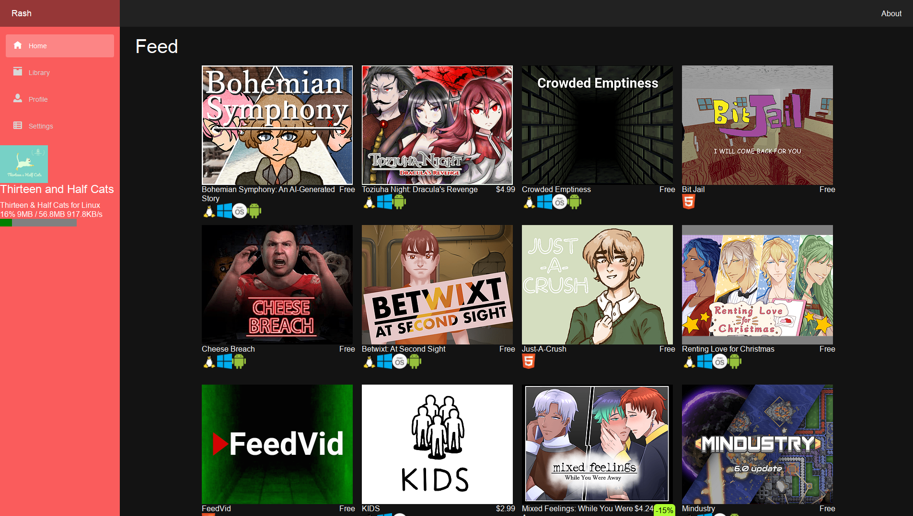

# Rash
An alternative cross-platform launcher for itch.io written in C# with Blazor  

## Status
Currently the app runs as a Blazor server-side application due to MS not supporting MAUI on Linux (and the WebWindow based alternatives don't work) and the tools required to build MAUI programs are not finished yet.  

If you're okay with that, the application lets you browse the itch.io store and your owned products, install them and show basic statistics about your created created games.  
There is no login dialog, you need to your token from cookies.  
Only game downloads of type upload are supported, builds are not supported (games published using butler).  

## Planned features
* Linux, MacOS, Windows and Android support with MAUI
* Running Windows programs using Wine (Linux, MacOS)
* Installing Android games using ADB or PackageManager on Android
* Downloading Web games and running them using a static file server
* Adding free games to your library without having to pay for them
* Throtled downloading
* Resuming downloads 

## Known issues
* Opening the library with a lot of owned products (~1000) will cause the browser to freeze.  
* The itch.io API is limited, some features can only be accessed using the store page. (e.g. game descriptions, download files you don't have a license for, tags and more)  
* `/GameByUrl/{url}` endpoint doesn't work in new tabs.  

# Contributing
If you'd like to contribute, please follow the rules bellow:
* Use tabs instead of space for indentation  
* Keep external dependencies to minimum  
* Use static classes instead of services/dependency injection  
* Use PascalCase for classes, interfaces, public members and all methods  
* Use camelCase for private members and function arguments.  
* Do not use underscore prefixes for private members, do not use the private keyword, as it's the defualt accessibility level  
* Do not open curly braces for one-line statements  